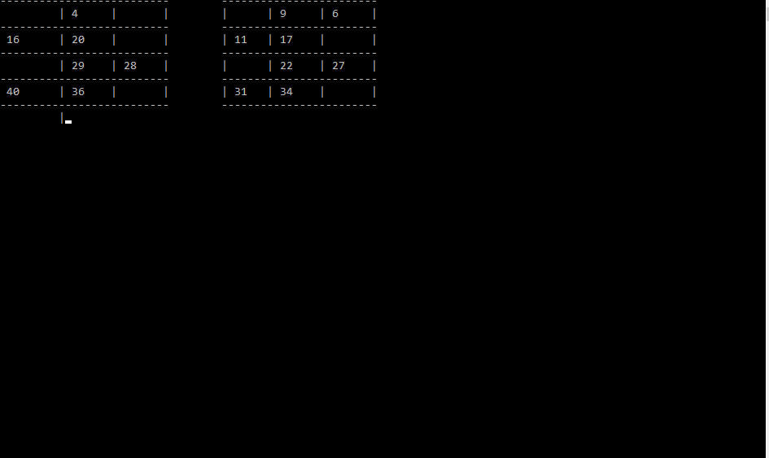

# "Russian lotto" - is a complete f**k!

## About

For a long time my wife and I bought tickets in the hope of winning a lotto and winning an apartment. But something I no longer like the trend, when I spend money, and in return, except for hope, I get nothing. I decided to calculate how many years we can win an apartment, given the probability, if we buy two tickets every weekend. The result on the face, even for 5,000 years, very rarely has the opportunity to win at least the second round (where the prize is at least a little serious amount - 2-5 of my monthly earnings).

The principle of operation is as follows:
- taking into account [the rules of the game](https://www.stoloto.ru/ruslotto/rules) random tickets are generated;
- then in order get the "kegs" with numbers;
- and depending on the sequence number on which all numbers were crossed out - it is determined whether you won any tour or not. From here, the probability is calculated.

The application "assembled on the knee", only for demonstration:

